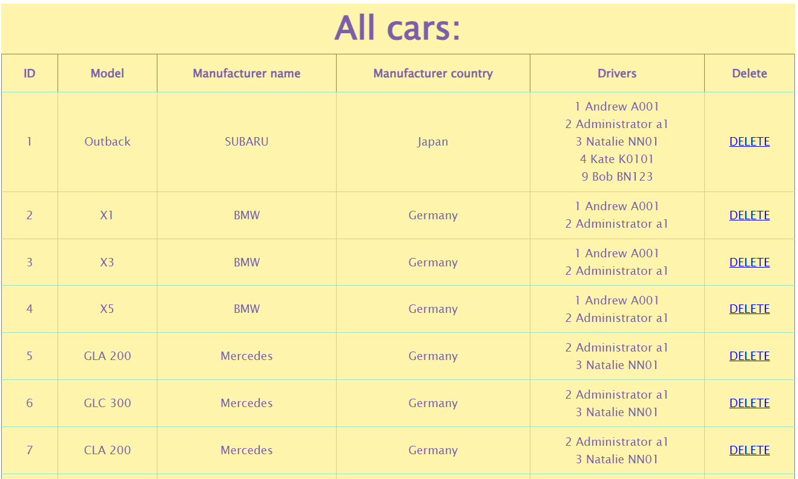

# **Taxi-Service** 

#### A simple web-application that supports authentication, registration and other CRUD operations.
#### Supports work with RDBMS.

## Features:
* create a new Driver with login and password;
* authentication as a Driver;
* remove Driver;
* logout;
* create/update/remove a Manufacturer;
* create/update/remove a Car;
* create/update/remove a Manufacturer;
* display list of all Cars;
* display list of all Cars of the current Driver;
* display list of all Drivers;
* display list of all Manufacturers;
* link the Driver with the Car;

## Technologies:
* JDK 11
* Apache Maven 4.0.0
* Tomcat 9.0.78
* Java Servlet API 4.0.1
* JSTL 1.2
* Apache Maven WAR Plugin 3.3.2
* HTML, CSS

## The project has:
* DAO level: here there are Interfaces and Classes which work with Data Base: CarDao, DriverDao and ManufacturerDao;
* Services level: here there is the service layer with services for all DAO levels and Authentication Service; 
* Controllers level: contains Servlets for all services.

## There are also packages:
* Exception - with Authentication and DataProcessing exceptions;
* Lib - with an Injector and Retention Annotations;
* Model - with Car, Driver and Manufacturer models inside;
* Util - with ConnectionUtil class where **you should write your information to connect to your DB;**
* Web.Filter - with Authentication Filter;
* Resources - with init_db.sql which **you should run in your DB scheme for create a new DB;**
* Webapp - with all JSP files.

##### Also, do not forget about **web.xml** and **pom.xml** files, which contain all necessary configurations.

## The application has simple and intuitive interface.
#### It uses Tomcat Local Server 9.0.78
#### You should add Tomcat Server to your configuration.
###
### When the app starts, there is the "login page":

###
### It is possible to create a new Driver for new users:

###
### After authentication all pages have links _"Home page"_ and _"Logout"_:

###
### It is easy to surf through the application and get all the information, for example, a List of all Cars with Drivers:

